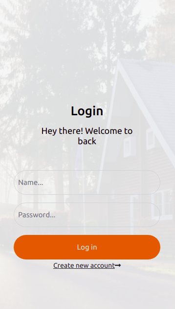
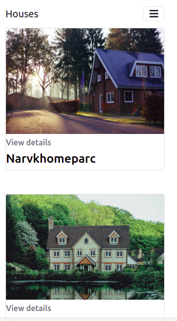
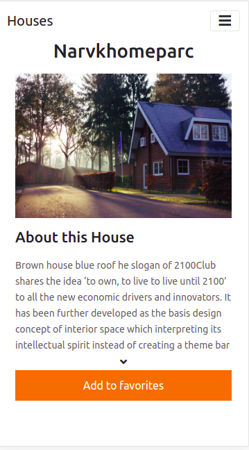
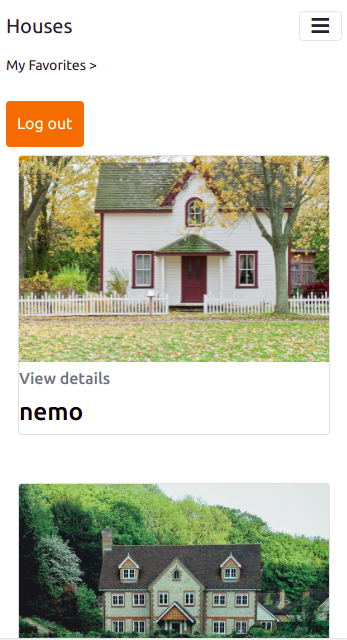

# Find your house

A    Final Capstone project where a logged in user can view a list of houses and click on each house to view details about it.
- On opening the app displays the login page
- User logs in if already has an account or can register for a new one
- If log in is successfull, User is presented with a list of houses where they can browse different houses
- User can view details about the house by clicking on the house.
- On the House details page, user can add a house to their favorites
- In the Navbar, User can navigate to "my favorites > " to see a list of their favorite houses.
 


## Login page

## List of houses


## House details

## Favorite houses


## Built With

- JavaScript
- React
- Redux
- houses-api
- Bootstrap
- CSS
## [Live Link](https://find-your-houses.herokuapp.com/)


# Getting Started 
To get started clone this repo
```
https://github.com/Byabasaija/find-your-house.git
```
Go to the project directory
```
npm install
npm start
```


This project was bootstrapped with [Create React App](https://github.com/facebook/create-react-app).

## Available Scripts

In the project directory, you can run:

### `npm start`

Runs the app in the development mode.\
Open [http://localhost:3000](http://localhost:3000) to view it in the browser.

The page will reload if you make edits.\
You will also see any lint errors in the console.

### `npm test`

Launches the test runner in the interactive watch mode.\
See the section about [running tests](https://facebook.github.io/create-react-app/docs/running-tests) for more information.

### `npm build`

Builds the app for production to the `build` folder.\
It correctly bundles React in production mode and optimizes the build for the best performance.

The build is minified and the filenames include the hashes.\
Your app is ready to be deployed!

See the section about [deployment](https://facebook.github.io/create-react-app/docs/deployment) for more information.

### `npm eject`

**Note: this is a one-way operation. Once you `eject`, you can’t go back!**

If you aren’t satisfied with the build tool and configuration choices, you can `eject` at any time. This command will remove the single build dependency from your project.

Instead, it will copy all the configuration files and the transitive dependencies (webpack, Babel, ESLint, etc) right into your project so you have full control over them. All of the commands except `eject` will still work, but they will point to the copied scripts so you can tweak them. At this point you’re on your own.

You don’t have to ever use `eject`. The curated feature set is suitable for small and middle deployments, and you shouldn’t feel obligated to use this feature. However we understand that this tool wouldn’t be useful if you couldn’t customize it when you are ready for it.

## Author

👤 **Pascal Byabasaija**

**Github** [Byabasaija](https://github.com/Byabasaija)

**Linkedin** [Pascal Byabasaija](https://linkedin/in/pascal-byabasaija)

**Twitter** [Pascal](https://twitter.com/byabashaijapoet)

## Acknowledgements
Design idea by [Alexey Savitskiy on Behance](https://www.behance.net/alexey_savitskiy)

## 🤝 Contributing

Contributions, issues, and feature requests are welcome!


## Show your support

Give a ⭐️ if you like this project!

## 📝 License

MIT